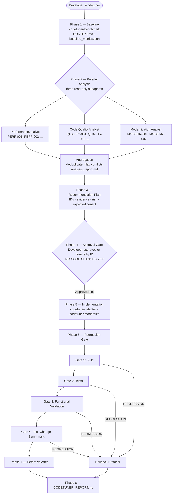

# CodeTuner

### Measure. Analyze. Improve. Prove it.

**CodeTuner** turns AI-assisted code optimization and modernization into a measurable, developer-controlled workflow — with real baselines, parallel analysis, a mandatory approval gate, and a regression gate that rejects any change that breaks the application.


---

## 🚀 Real Results

Demonstrated on the [RealWorld](https://github.com/gothinkster/realworld) Node.js + Express + Sequelize app — a realistic production-style codebase.

| Metric | Before | After | Change |
|--------|-------:|------:|-------:|
| `GET /api/articles` p50 latency | 618 ms | 230 ms | ↓ 62.8% |
| p95 latency | 902 ms | 406 ms | ↓ 55.0% |
| Throughput | 16.0 RPS | 41.6 RPS | ↑ 160% |
| DB queries / 20-article page | ~41 | ~2 | ↓ ~95% (est.) |
| Tests passing | 4 / 4 | 4 / 4 | No regression |

**Result: `ACCEPTED`** — two N+1 query patterns eliminated in a two-file change. All tests pass.

> Full details: [`realworld-example-app-Refactored/refactor_report.md`](realworld-example-app-Refactored/refactor_report.md)

---

## The Problem

Asking an AI to "optimize my code" is easy. Trusting the result is not.

Four hard questions go unanswered every time:

1. **What should change?** — Without structured analysis, recommendations are guesses, not findings.
2. **Is it safe?** — Nothing prevents a "faster" function from quietly breaking three tests.
3. **Did it actually improve?** — Before/after numbers are evidence. Intuition is not.
4. **Is the recommendation grounded in the code?** — A finding without a file, a line, and a correlated benchmark metric is noise.

The failure mode is predictable: a developer applies an AI suggestion, ships it, and discovers the problem later — or never.

---

## The Solution

CodeTuner wraps AI analysis in a structured workflow that requires evidence at every step.

```
Existing Codebase
  → Baseline benchmark (measured before anything changes)
  → Parallel analysis (Performance · Code Quality · Modernization)
  → Recommendation plan (finding IDs, evidence, risk, expected benefit)
  → Developer approval (nothing changes until you say so, by ID)
  → Implementation (only approved findings, one at a time)
  → Regression gate (Build → Tests → Functional → Benchmark)
  → Before vs After comparison (measured evidence only)
  → Final report
```

> **Performance without correctness is not an improvement.**

---

## Architecture



---

## CodeTuner Skills

Five IBM Bob skills compose the system. Each can be used standalone; `/codetuner` orchestrates all of them.

| Skill | Role |
|-------|------|
| `codetuner` | **Master orchestrator** — runs all 8 phases, enforces the approval gate, owns the final report |
| `codetuner-benchmark` | Project discovery, `CONTEXT.md`, benchmark script generation, `baseline_metrics.json` |
| `codetuner-review` | Targeted source-code analysis correlated with benchmark hot paths; writes `review_report.md` |
| `codetuner-refactor` | Applies one approved optimization, verifies with tests, reruns the benchmark, writes `refactor_report.md` |
| `codetuner-modernize` | Detects outdated dependencies, researches live registry versions, requires approval before any upgrade |

A developer can run `codetuner-benchmark` + `codetuner-review` to get a ranked, evidence-backed performance report without touching a single line of code.

---

## Human-in-the-Loop Safety

### Finding IDs and traceability

Every finding gets a stable ID the moment it is discovered. That ID follows it through every phase.

| ID prefix | Source | Scope |
|-----------|--------|-------|
| `PERF-001` … | Performance Analyst subagent (master workflow) | N+1 queries, blocking hot paths, unbounded queries |
| `QUALITY-001` … | Code Quality Analyst subagent (master workflow) | Dead code, duplication, structural waste |
| `MODERN-001` … | Modernization Analyst subagent (master workflow) | EOL runtimes, outdated packages |
| `CT-001` … | `codetuner-review` standalone skill | All of the above, from a single focused run |

```
Discovery → Recommendation Plan → Approval → Implementation → Regression Gate → Final Report
```

### Approval gate

**CodeTuner never modifies application code before explicit developer approval.**

After the recommendation plan is presented, the developer approves or rejects each finding by ID:

```
Approve PERF-001 and QUALITY-001. Reject MODERN-001 for now.
```

| ID | Finding | Decision |
|----|---------|----------|
| PERF-001 | N+1 query on `GET /api/articles` | ✅ Approved |
| QUALITY-001 | Duplicate favorite/unfavorite handlers | ✅ Approved |
| MODERN-001 | Node.js 14 → Node.js 22 LTS | ❌ Rejected |

Rejected items are never touched — not during this run, not during regression handling, not at any later point.

### Regression gate

Every approved change must pass four sequential gates before it can be classified as successful:

| Gate | Check |
|------|-------|
| 1 — Build | Type-check / compile passes |
| 2 — Tests | No previously passing test now fails |
| 3 — Functional | Smoke tests / health endpoints pass (or `NOT_VERIFIED` if unavailable) |
| 4 — Benchmark | Post-change metrics measured and compared to baseline |

**Classifications:**

| Label | Meaning |
|-------|---------|
| `ACCEPTED` | All gates pass, target metric improves |
| `REGRESSION` | A previously passing build, test, or functional check now fails |
| `NO_MEASURABLE_IMPROVEMENT` | Functionality intact; target metric did not improve |
| `NOT_VERIFIED` | Insufficient evidence — never promoted to `ACCEPTED` |

```
Before:  p50 500 ms   Tests: 42/42 ✅
After:   p50 250 ms   Tests: 37/42 ❌

Result: REGRESSION — not a successful optimization.
```

When a regression is detected, CodeTuner attempts one targeted correction within the approved scope. If unresolved, it proposes a rollback and documents the failure honestly. It never hides a failing test or claims success while regressions remain.

---

## Real-World Demo

### The demo project

| | Path |
|--|------|
| **Original** | [`node-express-sequelize-nextjs-realworld-example-app/`](node-express-sequelize-nextjs-realworld-example-app/) |
| **Post-optimization** | [`realworld-example-app-Refactored/`](realworld-example-app-Refactored/) |

The demo was run using the **standalone skills** (`codetuner-benchmark` → `codetuner-review` → `codetuner-refactor`), not the full `/codetuner` master orchestration.

### What the benchmark found

`GET /api/articles` was **36× slower** than every other endpoint:

| Route | p50 | p95 | RPS |
|-------|----:|----:|----:|
| `GET /api/articles` | **618 ms** | **902 ms** | 16 |
| `GET /api/articles/:slug` | 17 ms | 20 ms | 578 |
| `GET /api/articles/:slug/comments` | 50 ms | 64 ms | 201 |
| `GET /api/tags` | 3 ms | 5 ms | 2,922 |
| `GET /api/profiles/:username` | 3 ms | 5 ms | 3,042 |

### What `codetuner-review` found

9 findings across 1,253 analyzed lines. Top ranked:

| ID | Severity | Root cause |
|----|----------|-----------|
| CT-001 | **Critical** | `countFavoritedBy()` called per article in list — 20 extra `COUNT(*)` queries per page |
| CT-002 | High | `getTags()` called per article despite available JOIN — 20 more queries per page |
| CT-003 | Medium | Double author lookup in `GET /api/articles/:slug` |
| CT-004 | Medium | N+1 `hasFollow` per comment in comment list |
| CT-005–009 | Low | Unbounded query, redundant Promise, dead code, duplicate handlers |

**Estimated code bloat (analyzed scope): ~6%** — 75 of 1,253 lines.

### What `codetuner-refactor` applied

CT-001 and CT-002 were approved together (the review report recommended fixing them as a pair — same two files, same query).

**The fix:**
- Always include the tag association in `Article.findAndCountAll` (removed the conditional guard)
- Added a `sequelize.literal(...)` subquery for `favoritesCount` — computed once per page inside the list query
- Passed both pre-computed values into `toJson`, so `countFavoritedBy()` and `getTags()` are never called on a list path

**Result:**

| Metric | Before | After | Change |
|--------|-------:|------:|-------:|
| p50 latency | 618 ms | 230 ms | ↓ 62.8% |
| p95 latency | 902 ms | 406 ms | ↓ 55.0% |
| p99 latency | 904 ms | 502 ms | ↓ 44.5% |
| Throughput | 16.0 RPS | 41.6 RPS | ↑ 160% |
| DB queries / page | ~41 | ~2 | ↓ ~95% (est.) |
| Tests | 4 / 4 | 4 / 4 | No regression |

**Classification: `ACCEPTED`**

> Note: the tuned benchmark ran against a larger dataset (~500 articles vs ~20 at baseline). The N+1 problem is worse at larger dataset sizes, so the improvement on an equivalent dataset would be at minimum as large.

---

## Getting Started

**Prerequisites:** IBM Bob 2.0 installed. CodeTuner skills are in `.bob/skills/` — no installation required if you cloned this repo.

### Full workflow (one command)

Open your project in IBM Bob and run:

```
/codetuner
```

The master skill orchestrates all eight phases. It will stop and ask for your approval before modifying anything.

### Individual skills (focused tasks)

| Goal | Skill |
|------|-------|
| Baseline metrics only | `codetuner-benchmark` |
| Performance review only | `codetuner-review` (requires benchmark first) |
| Apply one optimization | `codetuner-refactor` (requires review first) |
| Dependency audit | `codetuner-modernize` |

### Benchmark execution note

`codetuner-benchmark` **generates** a self-contained `benchmark.js` script and then stops. The developer runs it manually:

```bash
node benchmark.js
```

The script handles server startup, seed data, benchmarking, and cleanup autonomously — no arguments or environment variables needed. It writes results to `.codetuner/baseline_metrics.json`. The master `/codetuner` workflow then picks up from that file.

> The same applies when the regression gate re-benchmarks after a change: the master skill re-invokes `codetuner-benchmark` to generate and run the post-change benchmark.

---

## IBM Bob 2.0 Integration

CodeTuner is a developer workflow **built on IBM Bob** — not an application that used Bob to generate code.

| Bob capability | How CodeTuner uses it |
|----------------|----------------------|
| **Skills** | Each phase is a structured Bob skill in `.bob/skills/`. The master `codetuner` skill orchestrates the others via `use_skill` without reimplementing their logic. |
| **Parallel subagents** | Phase 2 launches three concurrent read-only subagents via `spawn_subagent` in the same turn. The `"explore"` type enforces read-only — no subagent can modify code regardless of what it finds. |
| **Repository understanding** | Before generating the benchmark script, Bob inspects routes, models, middleware, and entry points across the entire project without developer guidance. |
| **Command execution** | The regression gate runs the real build, test suite, and benchmark via `execute_command`. Results are hard gate criteria, not suggestions. |
| **Developer interaction** | The approval gate uses `ask_followup_question` to pause the workflow. Nothing proceeds until the developer explicitly responds with finding IDs. |
| **Surgical code modification** | `codetuner-refactor` uses `apply_diff` to make the smallest possible targeted change — constrained to the approved finding's files and functions only. |
| **Evidence discipline** | Skill instructions explicitly prohibit inventing benchmark numbers, hiding regressions, claiming success while failures remain, or promoting `NOT_VERIFIED` to `ACCEPTED`. These constraints are enforced in the skill text itself. |

---

## Generated Artifacts

<details>
<summary>Full artifact tree</summary>

```
<your-project>/
├── CONTEXT.md                       # Architecture map: routes, models, middleware, entry point
├── benchmark.js                     # Generated zero-interaction benchmark script
├── MODERNIZATION_PLAN.md            # Written by codetuner-modernize after upgrade approval
├── CODETUNER_REPORT.md              # Final master report (full /codetuner run only)
│
└── .codetuner/
    ├── baseline_metrics.json        # Original benchmark — never overwritten
    ├── baseline_metrics.backup.json # Safety copy made before re-benchmarking
    ├── analysis_report.md           # Aggregated subagent findings (master workflow)
    ├── review_report.md             # Standalone codetuner-review output
    ├── refactor_report.md           # Per-optimization before/after report
    ├── regression_report.md         # Gate results and rollback log (master workflow)
    ├── tuned_metrics.json           # Post-optimization benchmark (codetuner-refactor)
    └── post_change_metrics.json     # Post-change benchmark (master workflow)
```

**What exists in this repo today** (from the standalone skill demo):
- `baseline_metrics.json` ✅ — both demo directories
- `baseline_metrics.backup.json` ✅ — `realworld-example-app-Refactored/`
- `review_report.md` ✅ — `realworld-example-app-Refactored/.codetuner/`
- `tuned_metrics.json` ✅ — `realworld-example-app-Refactored/.codetuner/`
- `refactor_report.md` ✅ — `realworld-example-app-Refactored/`

`CODETUNER_REPORT.md`, `analysis_report.md`, and `regression_report.md` are produced by the master `/codetuner` orchestration workflow, which has not yet been run end-to-end on this demo project.

</details>

---

## Project Structure

```
IBM-BOB-HACKATHON-ShipFast/
├── .bob/skills/
│   ├── codetuner/SKILL.md              # Master orchestration skill
│   ├── codetuner-benchmark/SKILL.md    # Discovery + benchmark generation
│   ├── codetuner-review/SKILL.md       # Performance + quality analysis
│   ├── codetuner-refactor/SKILL.md     # Targeted optimization + validation
│   └── codetuner-modernize/SKILL.md    # Stack modernization workflow
│
├── bob_sessions/                       # 8 screenshots of live IBM Bob development sessions
│
├── node-express-sequelize-nextjs-realworld-example-app/   # Original demo project
│   ├── .codetuner/baseline_metrics.json
│   └── benchmark.js
│
└── realworld-example-app-Refactored/                      # Post-optimization copy
    ├── .codetuner/
    │   ├── baseline_metrics.json
    │   ├── baseline_metrics.backup.json
    │   ├── review_report.md
    │   └── tuned_metrics.json
    └── refactor_report.md
```

---

## Hackathon Evidence

Built for the **IBM BOB Hackathon — ShipFast track**.

The [`bob_sessions/`](bob_sessions/) directory contains 8 screenshots of the live IBM Bob sessions used to design and build CodeTuner itself:

| Session | What was built |
|---------|---------------|
| task01–02 | `codetuner-benchmark` created and triggered on the RealWorld project |
| task03–05 | `codetuner-review` and `codetuner-refactor` created; review ran (9 findings); refactor ran (62.8% latency reduction, ACCEPTED) |
| task06 | `codetuner-modernize` created |
| task07–08 | Master `codetuner` orchestration skill created and refined |

The entire workflow — design, implementation, and demonstration — was done inside IBM Bob 2.0.

---

## Future Work

**Remaining demo findings** (identified, not yet applied):

- **CT-003** — Replace redundant `getAuthor()` call with already-loaded association — one-line fix
- **CT-004** — Pre-fetch followed-user set to eliminate N+1 `hasFollow` per comment
- **CT-005** — Add `LIMIT` to `Tag.findAll` — latent risk at scale
- **CT-008** — Extract shared handler for duplicate `POST/DELETE /:article/favorite` pair

**Not yet demonstrated end-to-end:**

- Full `/codetuner` master orchestration run (parallel subagents → approval gate → regression gate → `CODETUNER_REPORT.md`)
- `codetuner-modernize` execution against the RealWorld project (Node.js 14, Express 4.13, TypeScript 4.5 — all upgradable)
- CI integration wrapping the regression gate in a GitHub Actions workflow
