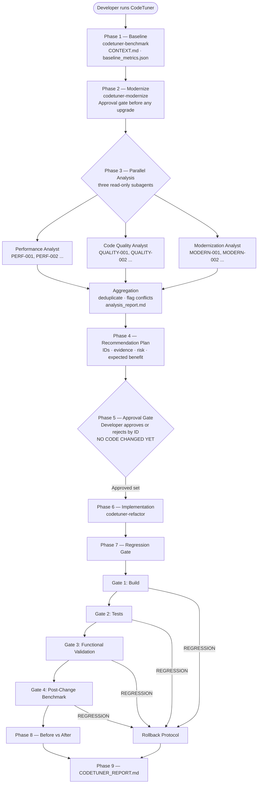

# CodeTuner

### Measure. Analyze. Improve. Prove it.

**CodeTuner** is a VS Code extension and a set of IBM Bob 2.0 skills that turn AI-assisted code optimization into a measurable, developer-controlled workflow — with real baselines, parallel analysis, a mandatory approval gate, and a regression gate that rejects any change that breaks the application.


---

## The Extension

The **CodeTuner VS Code Extension** provides a dedicated sidebar control panel for all five skills. Open the CodeTuner panel in the Activity Bar and manage your entire optimization workflow without leaving the editor.

### What the sidebar does

- **Injects and removes skills** — toggling a skill ON copies its `SKILL.md` into your workspace's `.bob/skills/` directory so Bob picks it up immediately. Toggling OFF removes it cleanly.
- **Master toggle cascades** — enabling **Full Run** automatically enables and locks all four sub-skills. Disable it to unlock individual skill selection.
- **Runs skills via chat** — clicking **Run** fires `workbench.action.chat.open` with the correct skill query, landing the session directly in Bob's native chat history.
- **Live metrics dashboard** — watches all `.codetuner/*.json` files across the workspace and renders a live comparison table (Method · Path · Baseline p95 · Tuned p95 · Gain %) the moment any metrics file is written. Picks the most recently modified post-optimization result automatically — works with `tuned_metrics.json` (standalone refactor), `post_change_metrics.json`, and `post_modernization_metrics.json` (master workflow).
- **Workspace config toggles** — each toggle persists to `.vscode/settings.json` under `codetuner.skills.*`.

### Install from the GitHub Release

> **Ready to install:** [Download `codetuner-0.1.1.vsix`](https://github.com/laufeyland/IBM-BOB-HACKATHON-ShipFast/releases/download/Extension/codetuner-0.1.1.vsix) from the [CodeTuner Extension v0.1.1 release](https://github.com/laufeyland/IBM-BOB-HACKATHON-ShipFast/releases/tag/Extension). Choose the **`.vsix` asset**, not the source-code ZIP.

1. Open **IBM Bob IDE** and sign in to your Bob account.
2. Open **Extensions** in the Activity Bar. Select the **⋯** menu, choose **Install from VSIX…**, and pick the downloaded `codetuner-0.1.1.vsix`. Reload the editor if prompted. [IBM documents this VSIX installation route](https://www.ibm.com/docs/en/bobz/3.0.0?topic=z-installing-extension-files).
3. Open the **project folder you want to improve** in Bob IDE. Select the **CodeTuner** icon in the Activity Bar to open its control panel.

The release asset is already packaged. You do not need to run `npm install` or compile the extension to use it.

### Run with the extension

| What you want | In the CodeTuner sidebar |
|---|---|
| **Complete workflow** | Turn **Full Run** on, then click **Run Full Workflow**. This enables the master skill and all four specialist skills in the open project. |
| **One focused skill** | Leave **Full Run** off, turn on **Benchmark**, **Modernize**, **Review**, or **Refactor**, then click its **Run** button. |

A toggle copies the selected `SKILL.md` into the open project's `.bob/skills/` folder. **Run** opens Bob chat with the matching request, such as `Use the codetuner skill.` Send it if the request is waiting in the chat input. Follow Bob's prompts: the full workflow asks you to approve findings before application-code changes. When benchmark files are available, the sidebar compares baseline and tuned p95 values by route.

> **Workspace tip:** Open the target project as a folder, not just an individual file. The extension uses the first workspace folder for skill injection and metrics. Review needs a baseline; Refactor needs baseline metrics and review findings.

### Run directly in Bob (without the extension)

1. Copy this repository's [`.bob/skills/` folders](https://github.com/laufeyland/IBM-BOB-HACKATHON-ShipFast/tree/main/.bob/skills) into `<your-project>/.bob/skills/`. If your project already has skills, merge the CodeTuner folders into it.
2. Open `<your-project>` as a workspace folder in IBM Bob IDE.
3. In Bob chat, send `Use the codetuner skill.` for the complete workflow. For a focused run, name a specialist instead, for example `Use the codetuner-benchmark skill.`

The skills work the same way without the sidebar. Bob writes the context, reports, and metrics into the project; you can inspect those files directly.

### Build from source (optional)

```bash
npm run compile   # tsc -p ./  →  out/
```

---

## The Skills

Five IBM Bob 2.0 skills compose the system. Each works standalone; **CodeTuner** (master) orchestrates all of them.

| Skill | Role |
|-------|------|
| `codetuner` | **Master orchestrator** — runs all phases, enforces the approval gate, owns the final report |
| `codetuner-benchmark` | Project discovery, `CONTEXT.md`, self-contained benchmark script, `baseline_metrics.json` |
| `codetuner-modernize` | Detects outdated dependencies, researches live registry versions, requires approval before any upgrade |
| `codetuner-review` | Source-code analysis correlated with benchmark hot paths; writes `review_report.md` |
| `codetuner-refactor` | Applies one approved optimization, verifies with tests, reruns benchmark, writes `refactor_report.md` |

Skills live in `.bob/skills/` and are loaded by Bob automatically when present in the workspace.

```
.bob/skills/
├── codetuner/SKILL.md              # Master orchestration skill
├── codetuner-benchmark/SKILL.md    # Discovery + benchmark generation
├── codetuner-modernize/SKILL.md    # Stack modernization workflow
├── codetuner-review/SKILL.md       # Performance + quality analysis
└── codetuner-refactor/SKILL.md     # Targeted optimization + validation
```

---

## The Workflow

```
Existing Codebase
  → Baseline benchmark        (measured before anything changes)
  → Stack modernization       (dependencies upgraded with approval)
  → Parallel analysis         (Performance · Code Quality · Modernization)
  → Recommendation plan       (finding IDs, evidence, risk, expected benefit)
  → Developer approval        (nothing changes until you say so, by ID)
  → Implementation            (only approved findings, one at a time)
  → Regression gate           (Build → Tests → Functional → Benchmark)
  → Before vs After           (measured evidence only)
  → Final report
```

> **Performance without correctness is not an improvement.**

A key design decision made during development (task 09): **Review runs after Modernize**, not before. This ensures the refactor phase operates on already-modernized code rather than applying optimizations to a legacy dependency tree that is about to change.

### Architecture



---

## Human-in-the-Loop Safety

### Finding IDs

Every finding gets a stable ID the moment it is discovered:

| ID prefix | Source | Scope |
|-----------|--------|-------|
| `PERF-001` … | Performance Analyst subagent | N+1 queries, blocking hot paths, unbounded queries |
| `QUALITY-001` … | Code Quality Analyst subagent | Dead code, duplication, structural waste |
| `MODERN-001` … | Modernization Analyst subagent | EOL runtimes, outdated packages |
| `CT-001` … | `codetuner-review` standalone | All of the above, from a single focused run |

### Approval gate

**CodeTuner never modifies application code before explicit developer approval.**

```
Approve PERF-001 and QUALITY-001. Reject MODERN-001 for now.
```

### Regression gate

| Gate | Check |
|------|-------|
| 1 — Build | Type-check / compile passes |
| 2 — Tests | No previously passing test now fails |
| 3 — Functional | Smoke tests / health endpoints pass |
| 4 — Benchmark | Post-change metrics measured and compared to baseline |

| Label | Meaning |
|-------|---------|
| `ACCEPTED` | All gates pass, target metric improves |
| `REGRESSION` | A previously passing check now fails |
| `NO_MEASURABLE_IMPROVEMENT` | Functionality intact; metric did not improve |
| `NOT_VERIFIED` | Insufficient evidence — never promoted to `ACCEPTED` |

---

## IBM Bob 2.0 Integration

| Bob capability | How CodeTuner uses it |
|----------------|----------------------|
| **Skills** | Each phase is a structured Bob skill in `.bob/skills/`. The master `codetuner` skill orchestrates the others via `use_skill` without reimplementing their logic. |
| **Parallel subagents** | Phase 3 launches three concurrent read-only subagents via `spawn_subagent` in the same turn. The `"explore"` type enforces read-only — no subagent can modify code. |
| **Repository understanding** | Before generating the benchmark script, Bob inspects routes, models, middleware, and entry points across the entire project without developer guidance. |
| **Command execution** | The regression gate runs the real build, test suite, and benchmark via `execute_command`. Results are hard gate criteria, not suggestions. |
| **Developer interaction** | The approval gate uses `ask_followup_question` to pause the workflow. Nothing proceeds until the developer responds with finding IDs. |
| **Surgical code modification** | `codetuner-refactor` uses `apply_diff` to make the smallest possible targeted change — constrained to the approved finding's files and functions only. |
| **Evidence discipline** | Skill instructions explicitly prohibit inventing benchmark numbers, hiding regressions, or promoting `NOT_VERIFIED` to `ACCEPTED`. |

---

## Demo Results

### Demo 1 — RealWorld (Node.js + Sequelize + Next.js)

The standalone skill chain was validated on a real production-style Node.js codebase:

> **Original repo:** https://github.com/cirosantilli/node-express-sequelize-nextjs-realworld-example-app

The standalone skill chain (`codetuner-benchmark` → `codetuner-review` → `codetuner-refactor`) was run against it. `GET /api/articles` was **36× slower** than every other endpoint — a classic N+1 problem.

### Baseline (20-article dataset)

| Route | p50 | p95 | RPS |
|-------|----:|----:|----:|
| `GET /api/articles` | **618 ms** | **902 ms** | 16 |
| `GET /api/articles/:slug` | 17 ms | 20 ms | 578 |
| `GET /api/articles/:slug/comments` | 50 ms | 64 ms | 201 |
| `GET /api/tags` | 3 ms | 5 ms | 2,922 |
| `GET /api/profiles/:username` | 3 ms | 5 ms | 3,042 |

`codetuner-review` found **9 findings** across 1,253 analyzed lines. Top two approved:

| ID | Severity | Root cause |
|----|----------|------------|
| CT-001 | **Critical** | `countFavoritedBy()` called per article — 20 extra `COUNT(*)` per page |
| CT-002 | **High** | `getTags()` called per article despite available JOIN — 20 more queries per page |

`codetuner-refactor` applied both as a pair (same two files, same query path):

- Always include tag association in `Article.findAndCountAll`
- Add a `sequelize.literal(...)` subquery for `favoritesCount` — computed once per page
- Pass both pre-computed values into `toJson` — `countFavoritedBy()` and `getTags()` are never called on the list path

### After (500-article dataset — harder conditions)

| Route | Baseline p50 | Tuned p50 | Baseline p95 | Tuned p95 | p95 Gain |
|-------|------------:|----------:|-------------:|----------:|--------:|
| `GET /api/articles` | 618 ms | **230 ms** | 902 ms | **406 ms** | **↓ 55%** |
| `GET /api/articles/:slug` | 17 ms | 103 ms | 20 ms | 205 ms | larger dataset |
| `GET /api/articles/:slug/comments` | 50 ms | 89 ms | 64 ms | 190 ms | larger dataset |
| `GET /api/tags` | 3 ms | 23 ms | 5 ms | 43 ms | larger dataset |
| `GET /api/profiles/:username` | 3 ms | 34 ms | 5 ms | 74 ms | larger dataset |

> The tuned benchmark ran against ~500 articles vs ~20 at baseline. All routes show higher absolute latency under the heavier load — but `GET /api/articles` dropped from 618 ms to 230 ms p50 **despite 25× more data**. The N+1 pattern amplifies with dataset size, so the actual improvement on an equivalent dataset is at minimum as large.

**`GET /api/articles` summary:**

| Metric | Before | After | Change |
|--------|-------:|------:|-------:|
| p50 latency | 618 ms | 230 ms | ↓ 62.8% |
| p95 latency | 902 ms | 406 ms | ↓ 55.0% |
| p99 latency | 904 ms | 502 ms | ↓ 44.5% |
| Throughput | 16.0 RPS | 41.6 RPS | ↑ 160% |
| DB queries / page | ~41 | ~2 | ↓ ~95% (est.) |
| Tests passing | 4 / 4 | 4 / 4 | No regression |

**Classification: `ACCEPTED`**

---

### Demo 2 — todos-express-sqlite (Express + SQLite)

The **full master `codetuner` skill** was run end-to-end against a small but realistic Express + SQLite todo app:

> **Original repo:** https://github.com/jaredhanson/todos-express-sqlite
> **Demo directory:** [`todos-express-sqlite/`](todos-express-sqlite/)

**Stack:** Node.js, Express 4.x, EJS templates, SQLite via `sqlite3` driver (no ORM), 8 HTTP handlers.

#### Initial Baseline (before any changes)

| Route | p50 | p95 | p99 | Throughput |
|-------|----:|----:|----:|-----------:|
| `GET /` | 8 ms | 10 ms | 13 ms | 1,211 rps |
| `GET /active` | 8 ms | 10 ms | 11 ms | 1,244 rps |
| `GET /completed` | 8 ms | 10 ms | 11 ms | 1,262 rps |

#### Modernization (14 findings, all approved)

Key changes applied by `codetuner-modernize`:

| What | Finding |
|------|---------|
| Express 4.16.4 → 4.22.3, EJS 2.6.2 → 3.1.10, debug 2.6.9 → 4.4.3, 4 more packages | MODERN-002–008 |
| Removed `mkdirp`; replaced with native `fs.mkdirSync` | MODERN-009 |
| Callback-based DB layer refactored to `async/await` | MODERN-012 |
| Added `helmet` security middleware | MODERN-014 |
| Added ESLint flat config, Prettier, Mocha test scaffold | MODERN-013 |
| Pinned Node.js to v24.x LTS via `.nvmrc` | MODERN-001 |

Modernization alone delivered a **~50% throughput improvement** before any code-level refactoring.

#### Refactor (14 findings, all approved)

Key changes applied by `codetuner-refactor`:

| What | Finding |
|------|---------|
| SQL `WHERE completed = ?` replaces JS in-memory filter | PERF-002 |
| `LIMIT 1000` on all `SELECT *` queries | PERF-001 |
| `CREATE INDEX idx_todos_completed` on `completed` column | PERF-003 |
| TTL cache with write invalidation (`todosCache`) | PERF-006 |
| `app.set('view cache', true)` — eliminates per-request EJS parse | PERF-005 |
| Single `completedToDb()`, `redirectPath()`, `asyncHandler()`, `safeFilter()` helpers | QUALITY-001,003,005,006 |
| `trimTitle` middleware; EJS `_filter_input.ejs` partial | QUALITY-002,007 |

#### Final Results (original baseline → post-refactor)

| Route | Baseline p50 | Tuned p50 | Baseline p95 | Tuned p95 | Throughput gain |
|-------|------------:|----------:|-------------:|----------:|----------------:|
| `GET /` | 8 ms | **4 ms** | 10 ms | **5 ms** | **+98%** |
| `GET /active` | 8 ms | **3 ms** | 10 ms | **4 ms** | **+138%** |
| `GET /completed` | 8 ms | **3 ms** | 10 ms | **3 ms** | **+187%** |

**Accepted changes:** 14 · **Regressions:** 0 · **Tests:** 2/2 pass · **Lint:** clean

**Classification: `ACCEPTED`**

---

## Generated Artifacts

<details>
<summary>Full artifact tree</summary>

```
IBM-BOB-HACKATHON-ShipFast/
├── CONTEXT.md                          # Architecture map: routes, models, middleware, entry point
├── benchmark.js                        # Generated zero-interaction benchmark script
├── MODERNIZATION_PLAN.md               # Written by codetuner-modernize after upgrade approval
├── CODETUNER_REPORT.md                 # Final master report (full codetuner run only)
│
└── .codetuner/
    ├── baseline_metrics.json           # Original benchmark — never overwritten
    ├── baseline_metrics.backup.json    # Safety copy made before re-benchmarking
    ├── analysis_report.md              # Aggregated subagent findings (master workflow)
    ├── review_report.md                # Standalone codetuner-review output
    ├── refactor_report.md              # Per-optimization before/after report
    ├── regression_report.md            # Gate results and rollback log (master workflow)
    ├── tuned_metrics.json              # Post-optimization benchmark (codetuner-refactor)
    ├── post_change_metrics.json        # Post-change benchmark (master workflow)
    └── post_modernization_metrics.json # Post-modernize benchmark (master workflow)
```

</details>

---

## Hackathon Evidence — 10 Bob Sessions

Every artefact in this repository — the skills, the extension, the benchmark results, and the workflow design — was built inside IBM Bob 2.0. The [`bob_sessions/`](bob_sessions/) directory contains screenshots of all 10 live sessions.

| # | Screenshot | Task | Bobcoins | Context used |
|---|-----------|------|----------:|-------------|
| 01 | `task01_create_benchmark_skill` | Authored `codetuner-benchmark` SKILL.md from scratch | 0.107 | 7% |
| 02 | `task02_trigger_benchmark_skill` | Ran benchmark against the RealWorld project — generated `benchmark.js`, produced `baseline_metrics.json` | 1.29 | 20% |
| 03 | `task03_create_review_refactor_skill` | Authored `codetuner-review` and `codetuner-refactor` skills via `/create-skill` | 0.327 | 11% |
| 04 | `task04_trigger_codetuner_review` | Ran `codetuner-review` — 9 findings across 1,253 lines, `review_report.md` written | 0.863 | 16% |
| 05 | `task05_trigger_codetuner_refactor` | Ran `codetuner-refactor` on CT-001 + CT-002 — 62.8% p50 reduction, **ACCEPTED** | 4.73 | 23% |
| 06 | `task06_create_modernize_skill` | Authored `codetuner-modernize` skill via `/create-skill` | 0.687 | 10% |
| 07 | `task07_create_codetuner_skill` | Authored master `codetuner` orchestration skill — pasted 279 lines of design context | 1.77 | 24% |
| 08 | `task08_update_codetuner_skill` | Refined the master skill ("Update the existing master CodeTuner skill") | 0.497 | 17% |
| 09 | `task09_fix_codetuner_skill` | Architecture decision: moved Review to run **after** Modernize so refactor operates on modernized code | 0.470 | 20% |
| 10 | `task10_make_codetuner_extension` | Built the VS Code extension — sidebar panel, skill injection, metrics dashboard (33-line spec → full implementation) | **11.79** | **50%** |

**Total: ~22.5 Bobcoins across 10 sessions.**

The extension session (task 10) consumed the most context (135.6k / 270k) and Bobcoins — it produced [`src/extension.ts`](src/extension.ts), [`src/ControlPanelProvider.ts`](src/ControlPanelProvider.ts), [`package.json`](package.json) manifest, and [`media/zap.svg`](media/zap.svg) in a single session from a 33-line requirements spec.
